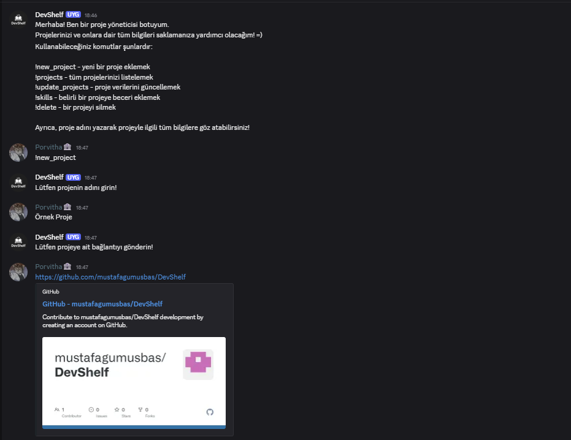

# 🌟 Portföy Botu 🌟

Merhaba! Ben **Portföy Botu** 🤖 — Discord üzerinde projelerinizi yönetmenizi sağlayan kişisel asistanınızım! 🎉  
Artık projelerinizi ekleyebilir, güncelleyebilir ve becerilerinizi gösterebilirsiniz! 🚀

---

## ⚡ Özellikler

- 🆕 Yeni projeler ekleyin  
- 📂 Tüm projelerinizi listeleyin  
- ✏️ Projelerinizi güncelleyin  
- 🛠️ Belirli projelere beceriler ekleyin  
- ❌ İstediğiniz projeyi silebilirsiniz  

---

## 💻 Kullanım

Bot ile etkileşim tamamen basit! Komutlar şunlar:

- `!start` - Bot ile tanışma ve kısa bilgi  
- `!info` - Tüm komutların açıklaması  
- `!new_project` - Yeni proje ekleme  
- `!projects` - Projelerinizi listeleme  
- `!update_projects` - Proje bilgilerini güncelleme  
- `!skills` - Projelere beceri ekleme  
- `!delete` - Projeyi silme  

Ayrıca proje adını yazarak doğrudan proje detaylarını görebilirsiniz! 🔍

---

## 🖼️ Ekran Görüntüleri

  

> İstersen kendi ekran görüntülerini bu alana ekleyebilirsin.

---

## 🎨 Kullanılan Teknolojiler

- Python 🐍  
- Discord.py 🎮  
- SQLite 🗄️  

---

## 🚀 Kurulum

1. Depoyu klonlayın:  
```bash
git clone https://github.com/kullaniciadi/portfolio-bot.git
